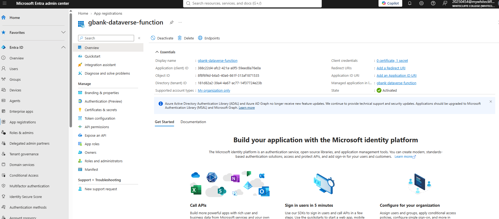
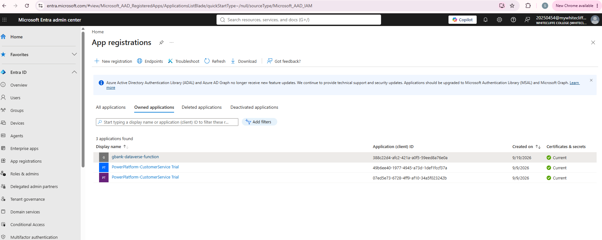
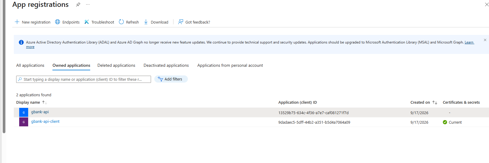
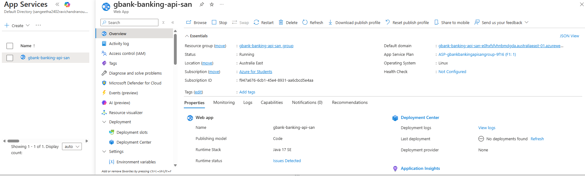
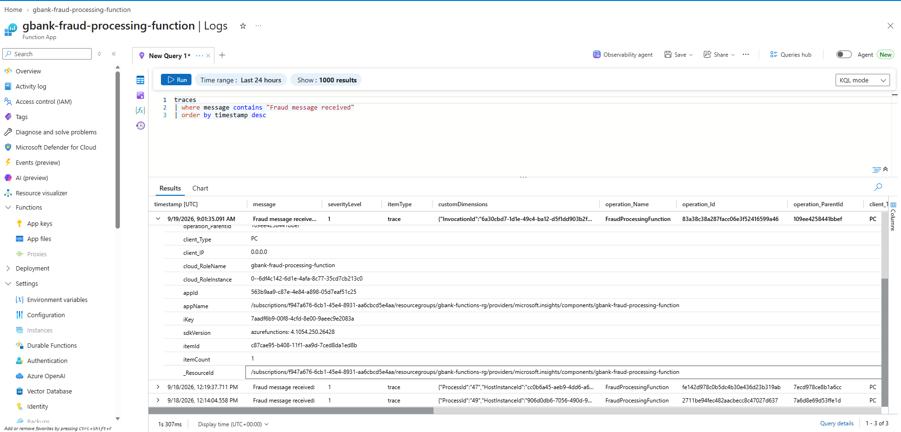
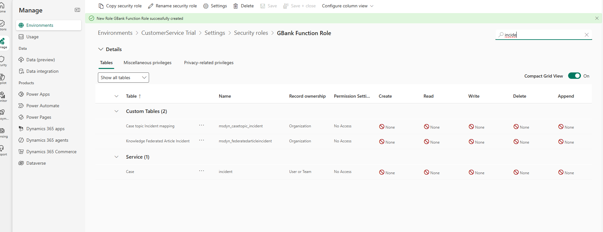

# GBank – Dynamics 365, PCF and Azure Integration Demo

This project demonstrates a hands-on banking integration scenario using **Microsoft Dynamics 365 / Dataverse, Power Apps Component Framework (PCF), Microsoft Entra ID and Azure Functions**.


## Project Goals

The project was created to demonstrate practical integration patterns used in enterprise Dynamics 365 and Azure solutions, including:

- Building a custom PCF control for Dynamics 365 / Dataverse
- Calling a Dataverse Custom API from a PCF control
- Working with Microsoft Entra ID App Registrations
- Using application identities for secure service-to-service integration
- Building Java-based Azure Functions
- Separating UI, Dataverse and Azure integration responsibilities

## High-Level Architecture

```text
Dynamics 365 / Model-driven App
        |
        v
PCF Customer Transactions Control
        |
        v
Dataverse Custom API
cr805_GetCustomerTransactions
        |
        v
Server-side / Integration Layer
        |
        +--------------------------+
        |                          |
        v                          v
Enterprise / Banking APIs     Azure Functions
                               Java 17
```

The PCF control provides the user-facing experience inside Dynamics 365. It takes a Customer ID, calls a Dataverse Custom API and displays the returned transaction information.

Azure Functions are used as a separate serverless integration component for backend processing scenarios.

## Repository 1 – PCF Customer Transactions Control

Repository: **PCF-CustomerTransactionsControl**

The PCF control is implemented in TypeScript using the Power Apps Component Framework.

### Current Behaviour

The control:

1. Displays a **Customer ID** input.
2. Provides a **Get Transactions** button.
3. Calls the Dataverse Custom API:

```text
/api/data/v9.2/cr805_GetCustomerTransactions
```

4. Sends the customer ID in the request body.
5. Reads the `TransactionsJson` response.
6. Parses the JSON into transaction objects.
7. Displays recent transactions in the Dynamics 365 user interface.

### Example Request

```json
{
  "CustomerId": "CUST1001"
}
```

### Transaction Data Model

The control currently handles transaction information such as:

```text
Transaction ID
Customer ID
Account Number
Amount
Transaction Type
Description
Transaction Date
Status
```

### PCF Technology

- Power Apps Component Framework
- TypeScript
- Dataverse Web API
- OData v4 headers
- HTML DOM rendering
- Power Platform build tooling
- ESLint

### Build the PCF Project

```bash
npm install
npm run build
```

For local development/testing:

```bash
npm start
```

## Repository 2 – Azure Functions Bank

Repository: **Azure-Functions-Bank**

This repository contains a Java-based Azure Functions project for banking backend processing.

### Technology

- Java 17
- Azure Functions Java Library
- Maven
- Azure Functions Maven Plugin
- Linux Azure Functions runtime

The Maven configuration currently defines a fraud-processing function application and uses Java 17.

### Build

```bash
mvn clean package
```

### Azure Deployment

The project is configured with the Azure Functions Maven plugin, allowing the function to be packaged and deployed through a Maven-based workflow.

A typical deployment command is:

```bash
mvn azure-functions:deploy
```

> Deployment requires the correct Azure subscription, resource group and permissions.

## Microsoft Entra ID / App Registration

Microsoft Entra ID App Registrations are used in the integration setup to represent APIs and calling applications.

### API and Client App Registrations

The following screenshot shows separate API and client application registrations used during the banking API integration setup.



A common client-credentials setup uses:

```text
Client Application
       |
       | Client ID + credential
       v
Microsoft Entra ID
       |
       | Access Token
       v
Protected API / APIM / Backend Service
```

### Dataverse Function App Registration

The project also includes an application registration for the Dataverse/Azure Function integration.



The application registration is configured in Microsoft Entra ID and can be used for service-to-service authentication where required.

### App Registration List






## Authentication Approach

For service-to-service communication, the preferred approach is:

- Use **Managed Identity** when the Azure services involved support it.
- Use an **App Registration** when an application identity is required.
- Store secrets securely in **Azure Key Vault** rather than source code or configuration files committed to GitHub.
- Use OAuth 2.0 access tokens for protected APIs.

No client secret values should ever be committed to this repository.

## Example End-to-End Flow

```text
1. Agent opens the Dynamics 365 application.
2. PCF control is loaded on the form.
3. Agent enters/selects a Customer ID.
4. Agent clicks Get Transactions.
5. PCF sends a POST request to the Dataverse Custom API.
6. Dataverse/server-side integration logic processes the request.
7. Backend transaction data is returned.
8. Custom API returns TransactionsJson.
9. PCF parses the JSON response.
10. Transactions are displayed to the agent.
```

## Why Use a Custom API?

A Dataverse Custom API is useful when a component needs to explicitly invoke a reusable business operation.

In this scenario, `GetCustomerTransactions` represents a clear business operation rather than logic that should automatically run on every Create or Update event.

This keeps the PCF control focused on UI behaviour while server-side components handle integration and business processing.

## Security Notes

This sample follows the principle that credentials should not be hard-coded.

Recommended production practices include:

- Microsoft Entra ID authentication
- Managed Identity where supported
- Azure Key Vault for secrets and certificates
- Minimum required API permissions
- Secret/certificate rotation
- HTTPS-only communication
- API Management policies where APIs are exposed through APIM
- Application Insights for monitoring and correlation

## Project Structure

### PCF Repository

```text
PCF-CustomerTransactionsControl/
├── CustomerTransactionsControl.pcfproj
├── SampleControl/
│   ├── ControlManifest.Input.xml
│   └── index.ts
├── package.json
├── tsconfig.json
├── eslint.config.mjs
└── pcfconfig.json
```

### Azure Functions Repository

```text
Azure-Functions-Bank/
├── pom.xml
└── src/
    └── main/
        └── java/
            └── com/
                └── gbank/
                    ├── Main.java
                    └── function/
                        └── FraudProcessingFunction.java
```

## Skills Demonstrated

This project demonstrates practical experience with:

- Dynamics 365 / Dataverse
- Power Apps Component Framework
- TypeScript
- Dataverse Custom API integration
- REST / Web API concepts
- Microsoft Entra ID
- OAuth 2.0 application authentication
- Azure Functions
- Java 17
- Maven
- Enterprise integration design
- Secure credential management concepts

## Related Repositories

### Azure Functions

https://github.com/sangeetha2402-ravichandran/Azure-Functions-Bank

### PCF Customer Transactions Control

https://github.com/sangeetha2402-ravichandran/PCF-CustomerTransactionsControl


